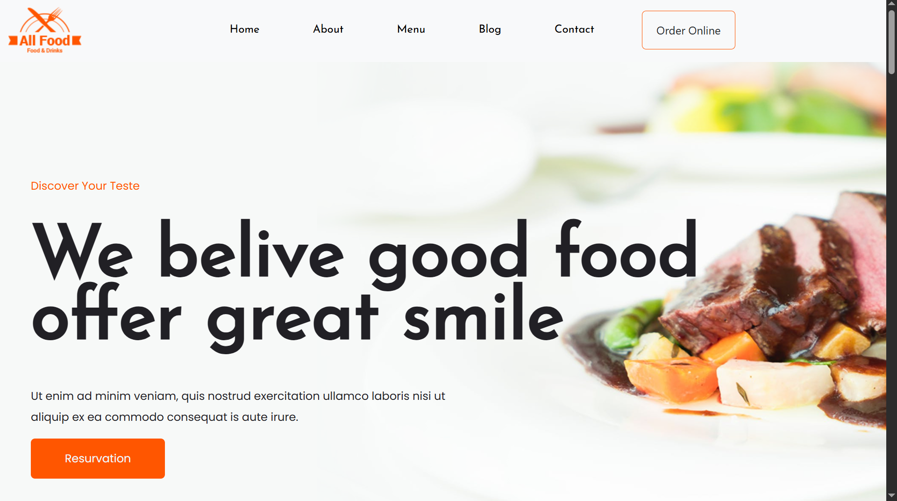

# 🍽️ Restaurant Website

A modern and responsive restaurant website built with **React + Vite** and **Bootstrap 5**.  
This project showcases a food & drinks business website with pages for Home, About, Menu, Blog, and Contact.

---

## 🚀 Features

- 🎨 Responsive and modern UI  
- 🖼️ Hero section with call-to-action button  
- 📋 Menu showcase section  
- 📖 Blog / Articles section  
- 📞 Contact form with address, phone, and email info  
- 🔗 Navigation bar with smooth layout  
- ⚡ Built with **Vite** for fast development  

---

## 🛠️ Tech Stack

- **React 18**  
- **Vite** (development + build tool)  
- **Bootstrap 5** (layout & components)  
- **CSS3** (custom styling)

---

